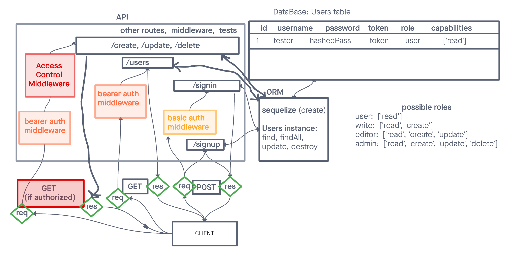

# LAB - Class 08 - Access Control

## Author

Guy Farley

## Problem Domain

### Phase 3 Requirements

In this final phase, the new requirement is to extend the restrictive capabilities of our routes to our API, implementing a fully functional, authenticated and authorized API Server using the latest coding techniques

Specifically, we want to make the following restrictions:

- Regular users can READ
- Writers can READ and CREATE
- Editors can READ, CREATE, and UPDATE
- Administrators can READ, CREATE, UPDATE, and DELETE

Routes that end up performing those actions in our API/Database need to be protected by both a valid user and that user’s permissions

## Links and Resources

<https://github.com/GuyFarley/auth-api>

## Setup

## How to initialize/run your application (where applicable)

This application can be run locally - it is not deployed to Heroku

## How to use your library (where applicable)

## Features / Routes

POST /signup to create a user
POST /signin to login a user and receive a token
GET /secret should require a valid bearer token
GET /users should require a valid token and “delete” permissions

V2 API Routes (/api/v2/...) must now be protected with the proper permissions based on user capability, using Bearer Authentication and an ACL
app.get(/:model) requires authentication only, no specific roles
app.post(...) requires both a bearer token and the create capability
app.put(...) requires both a bearer token and the update capability
app.patch(...) requires both a bearer token and the update capability
app.delete(...) requires both a bearer token and the delete capability

## Tests

Created tests using Jest and Supertest

## UML

